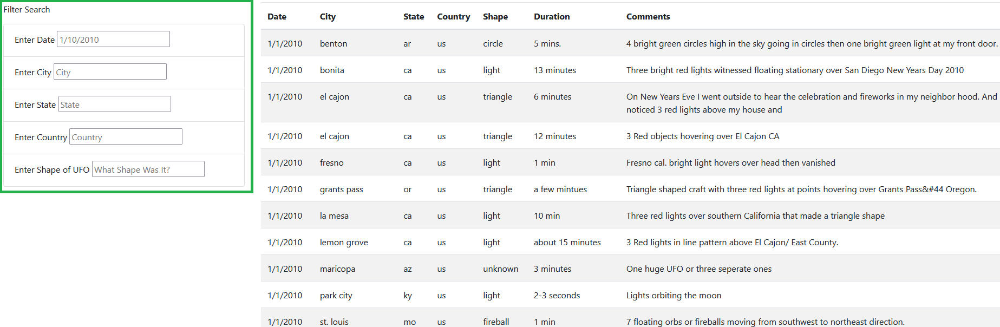
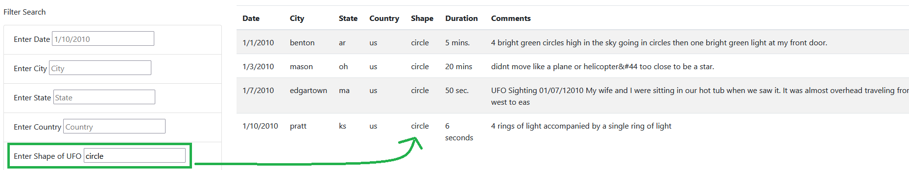
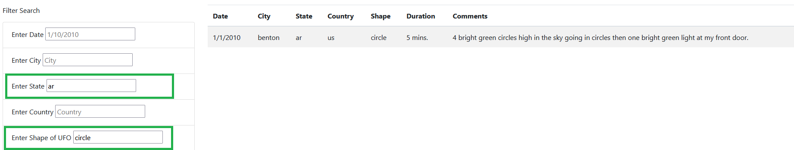
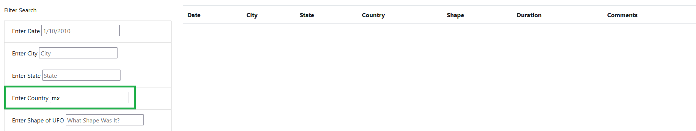

# UFOs - Overview of the Project

The purpose of this project was to build a dynamic webage using JavaScript and HTML. The webpage should display an article and a table with related information that users can filter based on multiple criteria. 

# Results

The result is a fully-functional webpage that includes an interactive table that can be filtered based on up to four search criteria (date, city, state, country, and shape of UFO). 

All the user has to do is follow the prompts loaded into the text box of each filter and watch as the results are whittled down. 

If the user attempts to filter the table using a criterion that doesn't exist in the database, an empty table will be returned (see image four.)

##### Table with All Filters Empty - No Criteria Entered

##### Table with One Filter Entered

##### Table with Two Filters Entered

##### Table with No Results for Filter

# Summary

This webpage is certainly useful for the needs of the client as outlined in the project description, but it is far from ideal. One of the design's major drawbacks is that the webpage depeds on a static data file stored locally to retrieve information. This prevents the user from being able to access the most current information. 

Two recommendations for further development of this project:
1. Refactor the code to utilize APIs and webscraping to keep the table data as up-to-date as possible.

2. Use Bootstrap and CSS to make the webpage look more polished and professional. 
